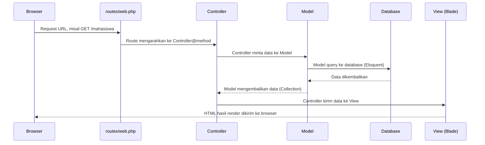

# 06. Instalasi & Struktur Laravel

Laravel adalah **PHP framework** paling populer untuk membangun aplikasi web modern. Ingat konsep "framework" dari modul 03 — Laravel menetapkan struktur & konvensi yang harus diikuti, sebagai gantinya kamu dapat banyak hal siap pakai (routing, ORM, validasi, auth, dll).

## Tujuan Belajar

- Berhasil menginstal Laravel baru dan menjalankannya.
- Kenal perintah dasar `artisan`.
- Paham fungsi file `.env` dan `config/`.
- Kenal struktur folder level atas (detail lengkap ada di modul 19).

## 1. Instalasi Laravel Baru

```bash
composer create-project laravel/laravel siakad-mini
cd siakad-mini
php artisan serve
```

Buka `http://127.0.0.1:8000` — kalau muncul halaman welcome Laravel, instalasi berhasil.

> Cek `composer.json` di root proyek Laravel-mu kapan saja untuk melihat versi Laravel dan dependency lain yang terpasang.

## 2. Artisan — "Tangan Kanan" Developer Laravel

`artisan` adalah command-line tool bawaan Laravel untuk generate kode dan menjalankan tugas.

```bash
php artisan list                          # lihat semua perintah yang tersedia
php artisan make:model Mahasiswa          # buat file Model
php artisan make:controller MahasiswaController
php artisan make:migration create_mst_mahasiswa_table
php artisan migrate                       # jalankan migration ke database
php artisan route:list                    # lihat semua route terdaftar
php artisan tinker                        # REPL PHP interaktif dengan akses ke aplikasi
```

`php artisan make:model Mahasiswa -mcr` sekaligus membuat **m**igration, **c**ontroller, dan menandai **r**esource controller — kombinasi flag yang sering dipakai untuk mempercepat setup fitur baru.

## 3. File `.env` — Konfigurasi Environment

```env
APP_NAME="SIAKAD Mini"
APP_ENV=local
APP_KEY=base64:xxxxxxx
APP_DEBUG=true
APP_URL=http://localhost

DB_CONNECTION=mysql
DB_HOST=127.0.0.1
DB_PORT=3306
DB_DATABASE=db_pendidikan
DB_USERNAME=root
DB_PASSWORD=
```

- `.env` berisi konfigurasi yang **berbeda-beda tiap environment** (lokal, staging, produksi) — kredensial database, API key pihak ketiga, mode debug.
- File ini **tidak boleh masuk Git** (sudah otomatis di-`.gitignore`) karena berisi rahasia.
- File `.env.example` (biasanya ada di root proyek) adalah template tanpa nilai rahasia — dishare ke tim, lalu tiap developer copy jadi `.env` sendiri dan isi nilainya.

> 📌 `DB_DATABASE=db_pendidikan` ini **bukan sembarang nama** — inilah database yang dipakai sepanjang journey ini, berisi 3 tabel master: `mst_mahasiswa`, `mst_dosen`, dan `mst_matakuliah` (detail lengkap skemanya di modul 08).

Cara membaca nilai `.env` di kode:
```php
config('database.connections.mysql.host'); // cara yang benar & direkomendasikan
env('DB_HOST'); // hindari dipakai di luar file config/, karena di-cache saat production
```

## 4. Struktur Folder Level Atas

```
siakad-mini/
├── app/                # Kode aplikasi: Model, Controller, Service, Middleware, dll
├── bootstrap/          # File bootstrap framework (jangan sering diutak-atik)
├── config/             # File konfigurasi (database.php, app.php, dst)
├── database/           # Migration, seeder, factory
├── public/             # Satu-satunya folder yang diakses publik (index.php, asset build)
├── resources/          # View (Blade), file CSS/JS mentah sebelum di-build
├── routes/             # Definisi URL (web.php, api.php, console.php)
├── storage/            # File upload, log, cache
├── tests/              # Automated test
├── artisan             # CLI tool
├── composer.json       # Daftar dependency PHP
└── .env                # Konfigurasi environment
```

> Pembahasan detail per-folder (isi `app/` sampai ke level `Http/Controllers`, `Http/Requests`, `Services`, dst) ada di [modul 19 — Arsitektur Folder](../19-arsitektur-folder-laravel-react/README.md). Modul ini baru mengenalkan peta besarnya.

## 5. Alur Request Singkat (Gambaran Besar)



Ini adalah pola **MVC (Model-View-Controller)** klasik yang dipakai Laravel untuk aplikasi server-rendered. Tiap bagian dari diagram ini akan dibahas mendalam di modul 07-11.

## Latihan

1. Instal Laravel baru dengan nama proyek `siakad-mini` di folder latihanmu.
2. Jalankan `php artisan serve`, screenshot/catat bahwa halaman welcome tampil.
3. Jalankan `php artisan route:list` — amati route apa saja yang sudah ada secara default.
4. Buka `.env`, set `DB_DATABASE=db_pendidikan` (belum perlu migrate dulu, itu di modul 08).

---
⬅️ [05. PHP Dasar & OOP](../05-php-dasar-oop/README.md) | ➡️ Lanjut ke [07. Routing & Controller](../07-routing-controller/README.md)
