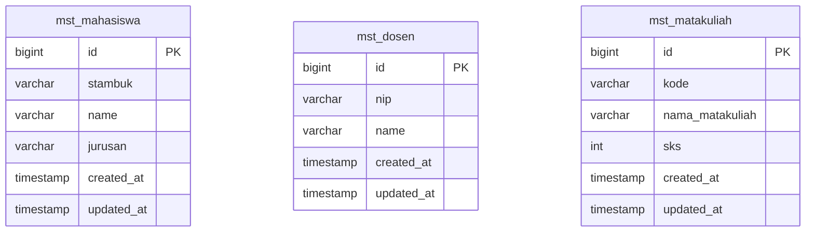

# 08. Model & Migration

Modul ini membahas dua hal yang selalu berpasangan di Laravel: **Migration** (struktur tabel database, ditulis sebagai kode PHP) dan **Model** (representasi tabel tersebut sebagai object PHP, lewat Eloquent ORM).

## Tujuan Belajar

- Paham migration: membuat, mengubah struktur tabel lewat kode (bukan klik manual di phpMyAdmin).
- Paham Model & Eloquent ORM: query data tanpa menulis SQL manual.
- Paham cara mengatasi nama tabel yang **tidak mengikuti konvensi default** Laravel.
- Paham seeder & factory untuk data dummy/testing.

## 0. Skema Database Acuan: `db_pendidikan`

Mulai modul ini, seluruh journey memakai **3 tabel master** berikut sebagai acuan tetap — persis strukturnya, tidak ditambah-tambah:



| Tabel | Kolom | Tipe | Keterangan |
|---|---|---|---|
| `mst_mahasiswa` | `id` | `bigint(20) unsigned` | Primary key, auto-increment |
| | `stambuk` | `varchar(11)` | Nomor induk mahasiswa |
| | `name` | `varchar(255)` | Nama lengkap |
| | `jurusan` | `varchar(255)` | Nama jurusan/program studi |
| | `created_at`, `updated_at` | `timestamp` | Otomatis dikelola Laravel |
| `mst_dosen` | `id` | `bigint(20) unsigned` | Primary key, auto-increment |
| | `nip` | `varchar(20)` | Nomor induk pegawai |
| | `name` | `varchar(255)` | Nama lengkap |
| | `created_at`, `updated_at` | `timestamp` | Otomatis dikelola Laravel |
| `mst_matakuliah` | `id` | `bigint(20) unsigned` | Primary key, auto-increment |
| | `kode` | `varchar(10)` | Kode mata kuliah, mis. `IF101` |
| | `nama_matakuliah` | `varchar(255)` | Nama mata kuliah |
| | `sks` | `int(11)` | Jumlah SKS |
| | `created_at`, `updated_at` | `timestamp` | Otomatis dikelola Laravel |

> 📌 **Ketiganya adalah tabel master independen** — tidak ada foreign key di antara `mst_mahasiswa`, `mst_dosen`, dan `mst_matakuliah` dalam skema ini (belum ada tabel transaksional seperti KRS/jadwal yang menghubungkan mereka). Karena itu, contoh kode di journey ini fokus ke CRUD masing-masing tabel, dan bagian relasi (§4) hanya membahas **konsepnya** secara ilustratif.
>
> 📌 **Perhatikan juga**: nama tabel memakai prefix `mst_` (singkatan "master") dan kolom `name` — ini **tidak mengikuti konvensi default Laravel** (yang mengharapkan nama tabel jamak seperti `mahasiswas` dan sering memakai kolom `nama`). Ini situasi **sangat umum** terjadi di dunia nyata ketika Laravel dipasang di atas database yang sudah ada (legacy database) — modul ini sekaligus mengajarkan cara mengatasinya.

## 1. Migration — Struktur Tabel Sebagai Kode

Kenapa tidak langsung bikin tabel manual di database? Karena migration bisa **di-commit ke Git**, di-share ke tim, dan dijalankan ulang persis sama di komputer siapa pun atau di server produksi.

```bash
php artisan make:migration create_mst_mahasiswa_table
php artisan make:migration create_mst_dosen_table
php artisan make:migration create_mst_matakuliah_table
```

```php
<?php
// database/migrations/xxxx_create_mst_mahasiswa_table.php

use Illuminate\Database\Migrations\Migration;
use Illuminate\Database\Schema\Blueprint;
use Illuminate\Support\Facades\Schema;

return new class extends Migration
{
    public function up(): void
    {
        Schema::create('mst_mahasiswa', function (Blueprint $table) {
            $table->id();
            $table->string('stambuk', 11);
            $table->string('name');
            $table->string('jurusan');
            $table->timestamps();
        });
    }

    public function down(): void
    {
        Schema::dropIfExists('mst_mahasiswa');
    }
};
```

```php
<?php
// database/migrations/xxxx_create_mst_dosen_table.php

use Illuminate\Database\Migrations\Migration;
use Illuminate\Database\Schema\Blueprint;
use Illuminate\Support\Facades\Schema;

return new class extends Migration
{
    public function up(): void
    {
        Schema::create('mst_dosen', function (Blueprint $table) {
            $table->id();
            $table->string('nip', 20);
            $table->string('name');
            $table->timestamps();
        });
    }

    public function down(): void
    {
        Schema::dropIfExists('mst_dosen');
    }
};
```

```php
<?php
// database/migrations/xxxx_create_mst_matakuliah_table.php

use Illuminate\Database\Migrations\Migration;
use Illuminate\Database\Schema\Blueprint;
use Illuminate\Support\Facades\Schema;

return new class extends Migration
{
    public function up(): void
    {
        Schema::create('mst_matakuliah', function (Blueprint $table) {
            $table->id();
            $table->string('kode', 10);
            $table->string('nama_matakuliah');
            $table->integer('sks');
            $table->timestamps();
        });
    }

    public function down(): void
    {
        Schema::dropIfExists('mst_matakuliah');
    }
};
```

Jalankan migration:
```bash
php artisan migrate            # terapkan semua migration yang belum jalan
php artisan migrate:rollback   # undo migration terakhir
php artisan migrate:fresh      # drop semua tabel, lalu migrate ulang dari nol (hati-hati, data hilang!)
```

### Tipe Kolom Umum

| Method | Tipe Data |
|---|---|
| `$table->string('name')` | VARCHAR (default 255 char) |
| `$table->string('stambuk', 11)` | VARCHAR dengan panjang custom (11 karakter) |
| `$table->integer('sks')` | INT |
| `$table->text('deskripsi')` | TEXT (panjang) |
| `$table->boolean('aktif')` | BOOLEAN |
| `$table->date('tanggal_lahir')` | DATE |
| `$table->foreignId('mahasiswa_id')->constrained('mst_mahasiswa')` | Foreign key ke tabel `mst_mahasiswa` |

## 2. Model — Representasi Tabel sebagai Object

```bash
php artisan make:model Mahasiswa
php artisan make:model Dosen
php artisan make:model MataKuliah
```

Secara default, Laravel menebak nama tabel dari nama Model dengan **pluralisasi otomatis** (`Mahasiswa` → `mahasiswas`). Karena tabel kita bernama `mst_mahasiswa` (bukan `mahasiswas`), kita **wajib** meng-override lewat property `$table`:

```php
<?php
// app/Models/Mahasiswa.php

namespace App\Models;

use Illuminate\Database\Eloquent\Model;

class Mahasiswa extends Model
{
    protected $table = 'mst_mahasiswa'; // wajib di-set karena beda dari konvensi default ("mahasiswas")

    protected $fillable = [
        'stambuk', 'name', 'jurusan',
    ];
}
```

```php
<?php
// app/Models/Dosen.php

namespace App\Models;

use Illuminate\Database\Eloquent\Model;

class Dosen extends Model
{
    protected $table = 'mst_dosen';

    protected $fillable = [
        'nip', 'name',
    ];
}
```

```php
<?php
// app/Models/MataKuliah.php

namespace App\Models;

use Illuminate\Database\Eloquent\Model;

class MataKuliah extends Model
{
    protected $table = 'mst_matakuliah';

    protected $fillable = [
        'kode', 'nama_matakuliah', 'sks',
    ];
}
```

`$fillable` adalah **whitelist** kolom yang boleh diisi lewat mass-assignment (`Mahasiswa::create([...])`) — ini pengaman supaya user tidak bisa menyuntik kolom sensitif lewat form yang tidak dikontrol dengan benar.

> 💡 Kalau lupa mengisi `$table` dan nama tabel tidak mengikuti konvensi, Laravel akan melempar error `Base table or view not found` saat query dijalankan — error ini **selalu** berarti "cek dulu nama tabel Model-nya sudah benar atau belum".

## 3. Eloquent ORM — Query Tanpa SQL Manual

```php
use App\Models\Mahasiswa;

// CREATE
$mahasiswa = Mahasiswa::create([
    'stambuk' => '20210011',
    'name' => 'Ahmad Fauzi',
    'jurusan' => 'Teknik Informatika',
]);

// READ
$semua = Mahasiswa::all();
$satu = Mahasiswa::find(1);
$satu = Mahasiswa::findOrFail(1); // 404 otomatis kalau tidak ketemu

$jurusanTI = Mahasiswa::where('jurusan', 'Teknik Informatika')->get();
$urut = Mahasiswa::orderBy('name', 'asc')->get();
$halaman = Mahasiswa::paginate(10); // pagination otomatis

// UPDATE
$mahasiswa = Mahasiswa::find(1);
$mahasiswa->update(['jurusan' => 'Sistem Informasi']);

// DELETE
$mahasiswa->delete();
```

Perbandingan dengan SQL murni supaya terasa manfaatnya:

```sql
-- SQL murni yang "digantikan" oleh Eloquent di atas
SELECT * FROM mst_mahasiswa WHERE jurusan = 'Teknik Informatika' ORDER BY name ASC;
```

Query yang sama juga berlaku identik untuk `Dosen` dan `MataKuliah`:

```php
use App\Models\Dosen;
use App\Models\MataKuliah;

$dosen = Dosen::create(['nip' => '198501012010121001', 'name' => 'Dr. Budi Hartono']);

$matkulBerat = MataKuliah::where('sks', '>=', 3)->orderBy('nama_matakuliah')->get();
```

## 4. Relasi Antar Tabel (Konsep)

Di skema `db_pendidikan` yang jadi acuan modul ini, `mst_mahasiswa`, `mst_dosen`, dan `mst_matakuliah` **berdiri sendiri-sendiri** — tidak ada foreign key di antara ketiganya. Tapi memahami konsep relasi Eloquent tetap penting untuk pengembangan lanjutan, jadi berikut ilustrasinya:

```php
// Ilustrasi SEANDAINYA ada tabel transaksional "krs" yang menghubungkan
// mahasiswa dengan matakuliah (many-to-many lewat tabel pivot):

class Mahasiswa extends Model
{
    protected $table = 'mst_mahasiswa';

    public function mataKuliah()
    {
        return $this->belongsToMany(MataKuliah::class, 'krs', 'mahasiswa_id', 'matakuliah_id');
    }
}
```

| Relasi | Contoh | Makna |
|---|---|---|
| `hasMany` | 1 Dosen mengampu banyak jadwal | 1 baris induk punya banyak baris anak |
| `belongsTo` | 1 baris jadwal milik 1 Dosen | Kebalikan dari `hasMany` |
| `hasOne` | 1 Mahasiswa punya 1 kartu KTM | Relasi satu-ke-satu |
| `belongsToMany` | Mahasiswa ↔ Mata Kuliah (lewat KRS) | Many-to-many, butuh tabel pivot |

> Latihan lanjutan di akhir modul ini mengajakmu benar-benar membuat tabel pivot semacam ini — tapi **studi kasus utama** di modul 12 dan 18 tetap fokus ke CRUD 3 tabel master saja, sesuai cakupan skema `db_pendidikan` di atas.

## 5. Seeder & Factory — Data Dummy

```bash
php artisan make:seeder MahasiswaSeeder
php artisan make:factory MahasiswaFactory --model=Mahasiswa
```

```php
// database/factories/MahasiswaFactory.php
public function definition(): array
{
    return [
        'stambuk' => fake()->unique()->numerify('2021####'),
        'name' => fake()->name(),
        'jurusan' => fake()->randomElement(['Teknik Informatika', 'Sistem Informasi', 'Ilmu Komputer']),
    ];
}
```

```php
// database/seeders/MahasiswaSeeder.php
public function run(): void
{
    Mahasiswa::factory()->count(10)->create();

    Mahasiswa::create([
        'stambuk' => '20210011',
        'name' => 'Ahmad Fauzi',
        'jurusan' => 'Teknik Informatika',
    ]);
}
```

```bash
php artisan db:seed --class=MahasiswaSeeder
```

## Studi Mini: Migration + Model + Query Sederhana

```bash
php artisan make:model Mahasiswa -m
```

Isi migration seperti contoh §1, lalu:

```bash
php artisan migrate
php artisan tinker
```

Di dalam `tinker` (REPL interaktif):
```php
>>> App\Models\Mahasiswa::create(['stambuk' => '20210011', 'name' => 'Ahmad Fauzi', 'jurusan' => 'Teknik Informatika']);
>>> App\Models\Mahasiswa::all();
>>> App\Models\Mahasiswa::where('jurusan', 'Teknik Informatika')->get();
```

## Latihan

1. Buat migration + model untuk ketiga tabel: `mst_mahasiswa` (Model `Mahasiswa`), `mst_dosen` (Model `Dosen`), `mst_matakuliah` (Model `MataKuliah`) — persis skema di §0.
2. Buat `MahasiswaSeeder`, `DosenSeeder`, dan `MataKuliahSeeder`, masing-masing mengisi minimal 5 data, jalankan dengan `php artisan db:seed`.
3. Coba di `tinker`: ambil semua mata kuliah dengan `sks >= 3`, urutkan berdasarkan `nama_matakuliah`.
4. (Opsional, latihan relasi) Buat migration tabel `krs` dengan kolom `mahasiswa_id` dan `matakuliah_id` (masing-masing `foreignId` merujuk ke `mst_mahasiswa` dan `mst_matakuliah`), lalu tambahkan relasi `belongsToMany` di kedua Model terkait.

---
⬅️ [07. Routing & Controller](../07-routing-controller/README.md) | ➡️ Lanjut ke [09. Request & Validation](../09-request-validation/README.md)
