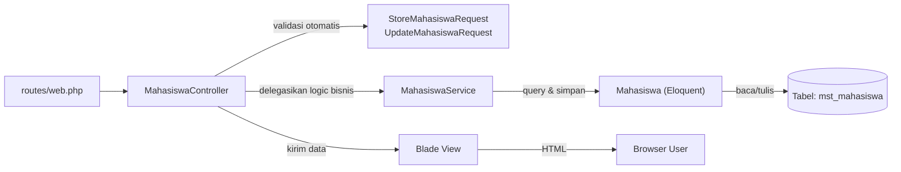

# 12. Studi Kasus: CRUD Lengkap "Manajemen Data Mahasiswa"

Ini adalah studi kasus yang **merangkai semua modul 06-11** menjadi satu fitur nyata, dengan struktur lengkap yang direkomendasikan untuk proyek serius: **Migration → Model → Request → Service → Controller → Response (View) → Routes**. Tidak ada logic yang diletakkan sembarangan — setiap file punya tanggung jawab yang jelas.

Studi kasus ini membangun CRUD untuk tabel **`mst_mahasiswa`** di database `db_pendidikan` (skema lengkap ada di [modul 08](../08-model-migration-database/README.md#0-skema-database-acuan-db_pendidikan)).

## Tujuan

Membangun fitur CRUD "Data Mahasiswa" (tambah, lihat, ubah, hapus) yang bisa diakses lewat halaman web (Blade), dengan struktur folder dan pemisahan tanggung jawab yang sama seperti dipakai proyek produksi.

## Arsitektur Fitur Ini



**Alur tanggung jawab:**
| Layer | Tanggung Jawab | Tidak Boleh Berisi |
|---|---|---|
| **Migration** | Struktur tabel database | Logic apapun |
| **Model** | Representasi tabel + nama tabel custom | Validasi input, logic bisnis kompleks |
| **Request** | Validasi & otorisasi input | Query database, logic bisnis |
| **Service** | Logic bisnis (aturan, orkestrasi antar model) | Kode terkait HTTP (request/response) |
| **Controller** | Terima request → panggil Service → kirim response | Validasi manual, query langsung, logic bisnis |
| **View (Blade)** | Tampilan | Logic bisnis, query database |
| **Routes** | Pemetaan URL ke Controller | Logic apapun |

## 1. Migration

```bash
php artisan make:model Mahasiswa -m
```

```php
<?php
// database/migrations/xxxx_create_mst_mahasiswa_table.php

use Illuminate\Database\Migrations\Migration;
use Illuminate\Database\Schema\Blueprint;
use Illuminate\Support\Facades\Schema;

return new class extends Migration
{
    public function up(): void
    {
        Schema::create('mst_mahasiswa', function (Blueprint $table) {
            $table->id();
            $table->string('stambuk', 11)->unique();
            $table->string('name');
            $table->string('jurusan');
            $table->timestamps();
        });
    }

    public function down(): void
    {
        Schema::dropIfExists('mst_mahasiswa');
    }
};
```

```bash
php artisan migrate
```

## 2. Model

```php
<?php
// app/Models/Mahasiswa.php

namespace App\Models;

use Illuminate\Database\Eloquent\Factories\HasFactory;
use Illuminate\Database\Eloquent\Model;

class Mahasiswa extends Model
{
    use HasFactory;

    protected $table = 'mst_mahasiswa'; // nama tabel tidak mengikuti konvensi default ("mahasiswas")

    protected $fillable = [
        'stambuk', 'name', 'jurusan',
    ];

    public function angkatan(): string
    {
        // 4 digit pertama stambuk dianggap sebagai tahun angkatan, mis. "20210011" -> "2021"
        return substr($this->stambuk, 0, 4);
    }
}
```

## 3. Form Request

```bash
php artisan make:request StoreMahasiswaRequest
php artisan make:request UpdateMahasiswaRequest
```

```php
<?php
// app/Http/Requests/StoreMahasiswaRequest.php

namespace App\Http\Requests;

use Illuminate\Foundation\Http\FormRequest;

class StoreMahasiswaRequest extends FormRequest
{
    public function authorize(): bool
    {
        return true;
    }

    public function rules(): array
    {
        return [
            'stambuk' => 'required|string|max:11|unique:mst_mahasiswa,stambuk',
            'name' => 'required|string|max:255',
            'jurusan' => 'required|string|max:255',
        ];
    }

    public function messages(): array
    {
        return [
            'stambuk.required' => 'Stambuk wajib diisi.',
            'stambuk.unique' => 'Stambuk ini sudah terdaftar.',
        ];
    }
}
```

```php
<?php
// app/Http/Requests/UpdateMahasiswaRequest.php

namespace App\Http\Requests;

use Illuminate\Foundation\Http\FormRequest;

class UpdateMahasiswaRequest extends FormRequest
{
    public function authorize(): bool
    {
        return true;
    }

    public function rules(): array
    {
        return [
            'stambuk' => 'sometimes|required|string|max:11|unique:mst_mahasiswa,stambuk,' . $this->mahasiswa->id,
            'name' => 'sometimes|required|string|max:255',
            'jurusan' => 'sometimes|required|string|max:255',
        ];
    }
}
```

## 4. Service

```php
<?php
// app/Services/MahasiswaService.php

namespace App\Services;

use App\Models\Mahasiswa;
use Illuminate\Database\Eloquent\Collection;
use Illuminate\Support\Facades\Log;

class MahasiswaService
{
    public function semua(): Collection
    {
        return Mahasiswa::orderBy('name')->get();
    }

    public function detail(int $id): Mahasiswa
    {
        return Mahasiswa::findOrFail($id);
    }

    public function buat(array $data): Mahasiswa
    {
        $mahasiswa = Mahasiswa::create($data);

        Log::info("Mahasiswa baru ditambahkan: {$mahasiswa->name} ({$mahasiswa->stambuk})");

        return $mahasiswa;
    }

    public function perbarui(Mahasiswa $mahasiswa, array $data): Mahasiswa
    {
        $mahasiswa->update($data);

        return $mahasiswa->fresh();
    }

    public function hapus(Mahasiswa $mahasiswa): void
    {
        Log::info("Mahasiswa dihapus: {$mahasiswa->name} ({$mahasiswa->stambuk})");

        $mahasiswa->delete();
    }
}
```

> Perhatikan: pencatatan log (`Log::info`) ditaruh di **Service**, bukan di Controller atau Model — supaya kalau logic ini nanti juga dibutuhkan dari API (modul 14) atau dari Artisan command (misal import data massal), cukup panggil method Service yang sama tanpa duplikasi.

## 5. Controller

```bash
php artisan make:controller MahasiswaController --resource
```

```php
<?php
// app/Http/Controllers/MahasiswaController.php

namespace App\Http\Controllers;

use App\Http\Requests\StoreMahasiswaRequest;
use App\Http\Requests\UpdateMahasiswaRequest;
use App\Models\Mahasiswa;
use App\Services\MahasiswaService;

class MahasiswaController extends Controller
{
    public function __construct(
        protected MahasiswaService $mahasiswaService,
    ) {}

    public function index()
    {
        $mahasiswa = $this->mahasiswaService->semua();

        return view('mahasiswa.index', compact('mahasiswa'));
    }

    public function create()
    {
        return view('mahasiswa.create');
    }

    public function store(StoreMahasiswaRequest $request)
    {
        $this->mahasiswaService->buat($request->validated());

        return redirect()
            ->route('mahasiswa.index')
            ->with('success', 'Data mahasiswa baru berhasil ditambahkan.');
    }

    public function show(Mahasiswa $mahasiswa)
    {
        return view('mahasiswa.show', compact('mahasiswa'));
    }

    public function edit(Mahasiswa $mahasiswa)
    {
        return view('mahasiswa.edit', compact('mahasiswa'));
    }

    public function update(UpdateMahasiswaRequest $request, Mahasiswa $mahasiswa)
    {
        $this->mahasiswaService->perbarui($mahasiswa, $request->validated());

        return redirect()
            ->route('mahasiswa.index')
            ->with('success', 'Data mahasiswa berhasil diperbarui.');
    }

    public function destroy(Mahasiswa $mahasiswa)
    {
        $this->mahasiswaService->hapus($mahasiswa);

        return redirect()
            ->route('mahasiswa.index')
            ->with('success', 'Data mahasiswa berhasil dihapus.');
    }
}
```

Perhatikan betapa **tipisnya** Controller ini — setiap method rata-rata 3-5 baris. Semua "kerumitan" sudah dipindah ke Request (validasi) dan Service (logic bisnis).

## 6. Routes

```php
<?php
// routes/web.php

use App\Http\Controllers\MahasiswaController;
use Illuminate\Support\Facades\Route;

Route::resource('mahasiswa', MahasiswaController::class);
```

Verifikasi 7 route sudah terbentuk:
```bash
php artisan route:list --name=mahasiswa
```

## 7. Response (View Blade)

```blade
{{-- resources/views/mahasiswa/index.blade.php --}}
@extends('layouts.app')

@section('title', 'Daftar Mahasiswa')

@section('content')
    <h1 class="text-2xl font-bold mb-4">Daftar Mahasiswa</h1>

    @if (session('success'))
        <div class="bg-green-100 text-green-800 p-3 rounded mb-4">{{ session('success') }}</div>
    @endif

    <a href="{{ route('mahasiswa.create') }}" class="bg-blue-600 text-white px-4 py-2 rounded inline-block mb-4">
        + Tambah Mahasiswa
    </a>

    <div class="grid grid-cols-1 md:grid-cols-3 gap-4">
        @foreach ($mahasiswa as $m)
            <div class="border rounded-lg p-4">
                <h3 class="font-bold">{{ $m->name }}</h3>
                <p class="text-gray-600">Stambuk: {{ $m->stambuk }}</p>
                <p>{{ $m->jurusan }}</p>

                <div class="flex gap-2 mt-3">
                    <a href="{{ route('mahasiswa.show', $m) }}">Detail</a>
                    <a href="{{ route('mahasiswa.edit', $m) }}">Edit</a>
                    <form action="{{ route('mahasiswa.destroy', $m) }}" method="POST"
                          onsubmit="return confirm('Yakin hapus data mahasiswa ini?')">
                        @csrf
                        @method('DELETE')
                        <button type="submit" class="text-red-600">Hapus</button>
                    </form>
                </div>
            </div>
        @endforeach
    </div>
@endsection
```

```blade
{{-- resources/views/mahasiswa/create.blade.php --}}
@extends('layouts.app')

@section('content')
    <h1 class="text-2xl font-bold mb-4">Tambah Mahasiswa</h1>

    <form method="POST" action="{{ route('mahasiswa.store') }}" class="space-y-4 max-w-md">
        @csrf

        <div>
            <label class="block font-medium">Stambuk</label>
            <input type="text" name="stambuk" value="{{ old('stambuk') }}" class="border rounded w-full p-2">
            @error('stambuk') <p class="text-red-600 text-sm">{{ $message }}</p> @enderror
        </div>

        <div>
            <label class="block font-medium">Nama Lengkap</label>
            <input type="text" name="name" value="{{ old('name') }}" class="border rounded w-full p-2">
            @error('name') <p class="text-red-600 text-sm">{{ $message }}</p> @enderror
        </div>

        <div>
            <label class="block font-medium">Jurusan</label>
            <select name="jurusan" class="border rounded w-full p-2">
                <option value="Teknik Informatika">Teknik Informatika</option>
                <option value="Sistem Informasi">Sistem Informasi</option>
                <option value="Ilmu Komputer">Ilmu Komputer</option>
            </select>
            @error('jurusan') <p class="text-red-600 text-sm">{{ $message }}</p> @enderror
        </div>

        <button type="submit" class="bg-blue-600 text-white px-4 py-2 rounded">Simpan</button>
    </form>
@endsection
```

`mahasiswa/edit.blade.php` dan `mahasiswa/show.blade.php` mengikuti pola yang sama (form edit memakai `@method('PUT')`, show hanya menampilkan detail).

## 8. Menjalankan & Menguji

```bash
php artisan migrate
php artisan serve
```

Buka `http://127.0.0.1:8000/mahasiswa`, coba:
1. Tambah data mahasiswa baru → cek flash message hijau muncul.
2. Submit form kosong → cek pesan error validasi tampil, dan input yang sudah diisi (`old()`) tidak hilang.
3. Tambah mahasiswa dengan stambuk yang **sama persis** dengan data yang sudah ada → harus gagal dengan pesan "Stambuk ini sudah terdaftar."
4. Edit data mahasiswa → cek data berubah.
5. Hapus data mahasiswa → berhasil, dan cek `storage/logs/laravel.log` untuk melihat baris log yang dicatat `MahasiswaService`.

## 9. Feature Test (Bonus — Kebiasaan Baik Sejak Awal)

```bash
php artisan make:test MahasiswaTest
```

```php
<?php
// tests/Feature/MahasiswaTest.php

use App\Models\Mahasiswa;

test('halaman daftar mahasiswa bisa diakses', function () {
    $response = $this->get(route('mahasiswa.index'));
    $response->assertOk();
});

test('user bisa menambah data mahasiswa baru', function () {
    $response = $this->post(route('mahasiswa.store'), [
        'stambuk' => '20210011',
        'name' => 'Ahmad Fauzi',
        'jurusan' => 'Teknik Informatika',
    ]);

    $response->assertRedirect(route('mahasiswa.index'));
    $this->assertDatabaseHas('mst_mahasiswa', ['stambuk' => '20210011']);
});

test('validasi gagal kalau stambuk kosong', function () {
    $response = $this->post(route('mahasiswa.store'), [
        'stambuk' => '',
        'name' => 'Ahmad Fauzi',
        'jurusan' => 'Teknik Informatika',
    ]);

    $response->assertSessionHasErrors('stambuk');
});

test('tidak bisa mendaftar dengan stambuk yang sudah dipakai', function () {
    Mahasiswa::create([
        'stambuk' => '20210011',
        'name' => 'Ahmad Fauzi',
        'jurusan' => 'Teknik Informatika',
    ]);

    $response = $this->post(route('mahasiswa.store'), [
        'stambuk' => '20210011',
        'name' => 'Nama Lain',
        'jurusan' => 'Sistem Informasi',
    ]);

    $response->assertSessionHasErrors('stambuk');
});
```

```bash
php artisan test --filter=MahasiswaTest
```

> Pola `assertDatabaseHas`, `assertSessionHasErrors`, dan `assertRedirect` di atas adalah pola standar Feature Test Laravel — dipakai untuk mengunci regresi setiap kali ada perubahan kode.

## Ringkasan: Kenapa Struktur Ini Layak Dibiasakan Sejak Belajar

Alternatifnya — menaruh semua kode di Controller — memang **terasa lebih cepat** untuk fitur kecil. Tapi begitu aplikasi bertambah fitur:
- Validasi yang bercampur logic bisnis susah dibaca ulang 6 bulan kemudian.
- Logic yang sama (misal "cek stambuk unik" atau "catat log aktivitas") harus dipakai lagi dari API (modul 14) — kalau sudah di Service, tinggal panggil; kalau masih di Controller, harus copy-paste.
- Testing jadi jauh lebih mudah karena Service bisa dites terpisah tanpa perlu simulasi HTTP request penuh.

## Latihan Lanjutan

1. Ulangi seluruh pola di atas (migration → model → request → service → controller → routes → view) untuk **`mst_dosen`** (Model `Dosen`) dan **`mst_matakuliah`** (Model `MataKuliah`) — inilah cara paling efektif menguatkan pola ini: replikasi manual, bukan copy-paste.
2. Tambahkan fitur pencarian: `Route::get('/mahasiswa/cari')` yang memfilter berdasarkan `name` atau `jurusan` (tambahkan method di Service, bukan query langsung di Controller).
3. Tulis 2 Feature Test tambahan untuk `MataKuliahController`: menambah mata kuliah baru, dan gagal menambah kalau `kode` sudah dipakai mata kuliah lain.

---
⬅️ [11. Response & View/Blade](../11-response-view-blade/README.md) | ➡️ Lanjut ke [13. Konsep REST API](../13-konsep-api-rest/README.md)
