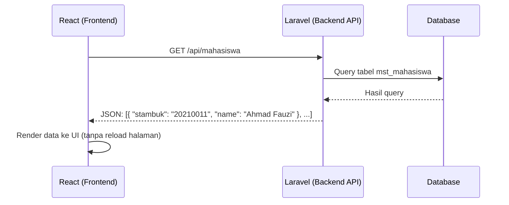

# 13. Konsep REST API

Sebelum masuk ke setup API di Laravel (modul 14) dan fetch API di React (modul 17), penting paham dulu **konsepnya** secara bahasa-agnostik. API adalah "jembatan" yang memungkinkan backend (Laravel) dan frontend (React) berkomunikasi tanpa harus reload halaman penuh.

## Tujuan Belajar

- Paham apa itu API dan kenapa dibutuhkan untuk arsitektur decoupled (backend + frontend terpisah).
- Paham HTTP method dan kapan masing-masing dipakai.
- Paham HTTP status code yang umum.
- Paham format data JSON.
- Bisa menguji API dengan Postman/Thunder Client tanpa perlu frontend.

## 1. Apa Itu API?

**API (Application Programming Interface)** adalah cara dua program saling "bicara". Dalam konteks web, **REST API** adalah gaya API yang paling umum: klien (React, mobile app, aplikasi lain) mengirim HTTP request ke server (Laravel), server membalas dengan data — biasanya format **JSON**.



Bandingkan dengan pola Blade (modul 06-12): di sana, **server** yang merender HTML lengkap dan mengirimnya ke browser. Dengan API, **server hanya kirim data mentah (JSON)** — tampilan (UI) sepenuhnya jadi tanggung jawab frontend (React).

| | Blade (Server-Rendered) | REST API + React (Decoupled) |
|---|---|---|
| Yang dikirim server | HTML lengkap | JSON data mentah |
| Yang merender UI | Server (Laravel) | Browser (React) |
| Reload halaman saat interaksi? | Biasanya ya (kecuali pakai Alpine.js/AJAX) | Tidak — hanya data yang di-fetch ulang |
| Cocok untuk | Website konten, dashboard admin sederhana | Aplikasi interaktif, SPA, aplikasi mobile berbagi 1 backend |

## 2. HTTP Method — "Kata Kerja" dari Request

| Method | Fungsi | Contoh |
|---|---|---|
| `GET` | Ambil data (tidak mengubah apapun) | `GET /api/mahasiswa` — ambil semua data mahasiswa |
| `POST` | Buat data baru | `POST /api/mahasiswa` — tambah mahasiswa baru |
| `PUT` | Update **seluruh** data (ganti semua field) | `PUT /api/mahasiswa/1` |
| `PATCH` | Update **sebagian** data | `PATCH /api/mahasiswa/1` — hanya update `jurusan` |
| `DELETE` | Hapus data | `DELETE /api/mahasiswa/1` |

Prinsip penting: `GET` **tidak boleh** mengubah data di server (disebut *safe method*) — kalau butuh mengubah data, harus pakai `POST`/`PUT`/`PATCH`/`DELETE`.

## 3. HTTP Status Code

| Kode | Arti | Kapan Dipakai |
|---|---|---|
| `200 OK` | Berhasil | Response sukses standar (GET, PUT berhasil) |
| `201 Created` | Berhasil membuat data baru | Response setelah `POST` berhasil |
| `204 No Content` | Berhasil, tidak ada body dikembalikan | Response setelah `DELETE` berhasil |
| `400 Bad Request` | Request tidak valid/salah format | Input tidak sesuai format yang diharapkan |
| `401 Unauthorized` | Belum login / token tidak valid | Akses API yang butuh autentikasi tanpa token |
| `403 Forbidden` | Sudah login, tapi tidak punya izin | Mahasiswa mengakses endpoint khusus admin akademik |
| `404 Not Found` | Data/endpoint tidak ditemukan | `GET /api/mahasiswa/9999` yang tidak ada |
| `422 Unprocessable Entity` | Validasi gagal | Laravel otomatis pakai ini untuk error validasi API |
| `500 Internal Server Error` | Error di server (bug) | Exception yang tidak tertangani |

## 4. Format JSON

```json
{
  "id": 1,
  "stambuk": "20210011",
  "name": "Ahmad Fauzi",
  "jurusan": "Teknik Informatika",
  "created_at": "2026-07-01T08:00:00.000000Z"
}
```

Aturan JSON:
- Key **selalu** pakai tanda kutip ganda `"key"`.
- Tipe data: string, number, boolean (`true`/`false`), `null`, array `[...]`, object `{...}`.
- **Tidak ada** komentar di JSON (beda dengan JS biasa).

Response list biasanya dibungkus dalam array atau object dengan key `data`:

```json
{
  "data": [
    { "id": 1, "stambuk": "20210011", "name": "Ahmad Fauzi", "jurusan": "Teknik Informatika" },
    { "id": 2, "stambuk": "20210012", "name": "Siti Rahma", "jurusan": "Sistem Informasi" }
  ]
}
```

## 5. Menguji API Tanpa Frontend — Postman/Thunder Client

Sebelum React siap (modul 15+), API **harus** bisa diuji berdiri sendiri. Ini kebiasaan penting: backend dan frontend dikembangkan dan diuji **secara independen**.

Contoh request di Postman:
```
GET http://localhost:8000/api/mahasiswa
Headers:
  Accept: application/json
```

Contoh POST dengan body JSON:
```
POST http://localhost:8000/api/mahasiswa
Headers:
  Accept: application/json
  Content-Type: application/json
Body (raw JSON):
{
  "stambuk": "20210012",
  "name": "Siti Rahma",
  "jurusan": "Sistem Informasi"
}
```

Alternatif ringan tanpa install aplikasi terpisah: extension **Thunder Client** atau **REST Client** di VS Code.

## 6. Prinsip REST (Sekilas)

REST (Representational State Transfer) adalah gaya arsitektur dengan beberapa prinsip:
- **Stateless** — server tidak menyimpan "sesi percakapan"; setiap request harus membawa semua informasi yang dibutuhkan (misal token auth di header).
- **Resource-based URL** — URL merepresentasikan "benda" (resource), bukan aksi. `GET /api/mahasiswa/1` (benar) vs `GET /api/getMahasiswaById?id=1` (kurang RESTful).
- **Uniform interface** — pakai HTTP method standar (GET/POST/PUT/DELETE) untuk merepresentasikan aksi, bukan bikin endpoint sendiri untuk tiap aksi.

## Latihan

1. Install Postman atau Thunder Client (extension VS Code).
2. Coba request `GET` ke API publik gratis: `https://jsonplaceholder.typicode.com/users` — amati status code, header response, dan format JSON-nya.
3. Coba `POST` ke `https://jsonplaceholder.typicode.com/posts` dengan body JSON `{ "title": "Halo", "body": "Isi post" }` — amati response `201 Created`.
4. Buat tabel di kertas/catatan: untuk fitur "Mahasiswa" dari modul 12, tentukan endpoint + method + status code yang seharusnya untuk index, show, store, update, destroy.

---
⬅️ [12. Studi Kasus: CRUD Lengkap](../12-studi-kasus-crud-mvc-service/README.md) | ➡️ Lanjut ke [14. Setup API di Laravel](../14-setup-api-laravel/README.md)
