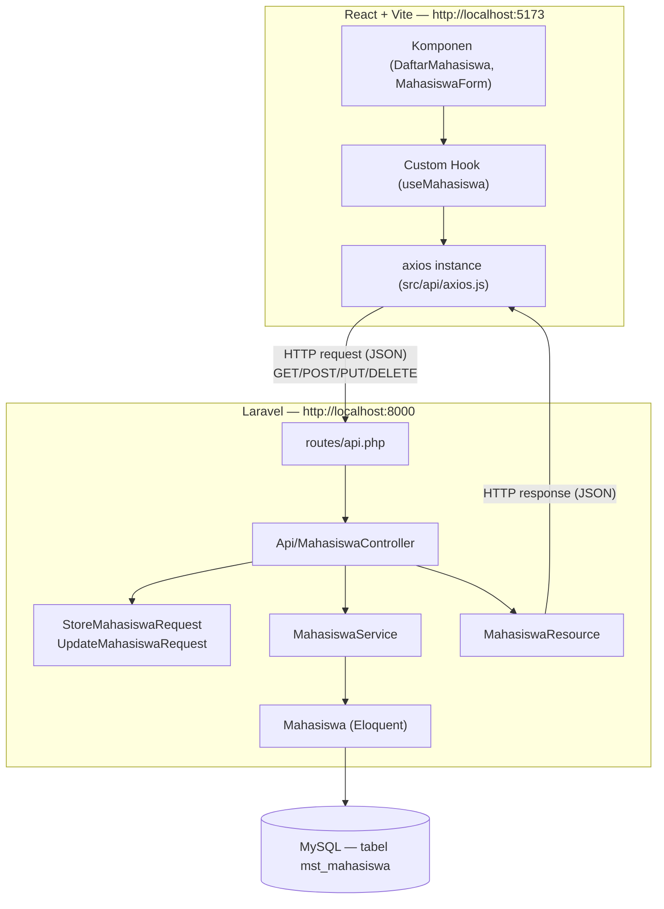
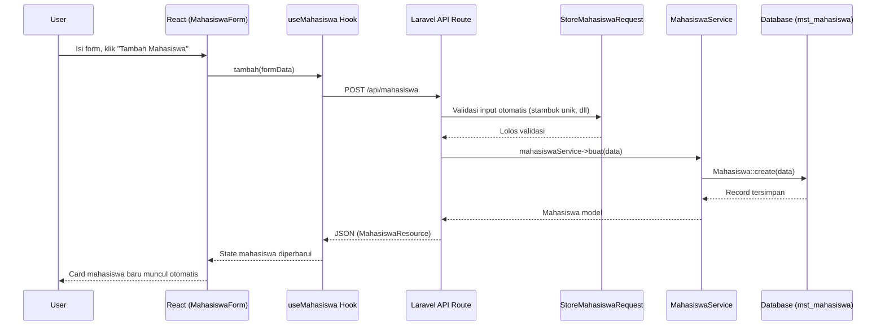

# 18. Studi Kasus: Integrasi Full-Stack (Laravel API + React SPA)

Ini adalah puncak dari seluruh journey — menyatukan **backend Laravel** (modul 06-14) dengan **frontend React** (modul 15-17) menjadi satu aplikasi full-stack yang berjalan sebagai 2 proses terpisah namun saling terhubung lewat REST API.

## Tujuan

Membangun ulang fitur "Manajemen Data Mahasiswa" dari modul 12, kali ini dengan **arsitektur decoupled**: Laravel murni jadi API (tanpa Blade), React jadi satu-satunya yang merender UI. Tabel yang dipakai tetap `mst_mahasiswa` di database `db_pendidikan`, persis skema di [modul 08](../08-model-migration-database/README.md#0-skema-database-acuan-db_pendidikan).

## Arsitektur Keseluruhan



**Poin kunci arsitektur ini:**
- Laravel **tidak lagi merender HTML** untuk fitur ini — cukup jadi penyedia data (API).
- React **tidak tahu apa-apa** soal database, migration, atau Eloquent — dia hanya tahu "kontrak" JSON yang disepakati lewat API Resource.
- Kedua sisi bisa dikembangkan, dites, bahkan di-deploy **secara terpisah**.

## 1. Persiapan Backend (Laravel)

Gunakan hasil modul 08-10 dan 14 (migration, model, request, service, `Api\MahasiswaController`, `MahasiswaResource` untuk `Mahasiswa` sudah ada). Kalau belum, ikuti dulu modul-modul tersebut.

Pastikan CORS mengizinkan origin React (lihat modul 14 §5):

```php
// config/cors.php
'paths' => ['api/*'],
'allowed_origins' => ['http://localhost:5173'],
'supports_credentials' => true,
```

Jalankan backend:
```bash
php artisan serve
# berjalan di http://127.0.0.1:8000
```

Verifikasi API hidup dengan Postman/browser:
```
GET http://127.0.0.1:8000/api/mahasiswa
```

## 2. Persiapan Frontend (React + Vite)

```bash
npm create vite@latest mahasiswa-frontend -- --template react
cd mahasiswa-frontend
npm install axios
npm run dev
# berjalan di http://localhost:5173
```

### Struktur Folder Frontend untuk Studi Kasus Ini

```
mahasiswa-frontend/src/
├── api/
│   └── axios.js              # instance axios dengan baseURL API Laravel
├── components/
│   ├── MahasiswaCard.jsx      # tampilan 1 mahasiswa
│   └── MahasiswaForm.jsx      # form tambah mahasiswa
├── hooks/
│   └── useMahasiswa.js        # custom hook fetch + mutasi data
├── App.jsx                     # merangkai semua komponen
└── main.jsx
```

## 3. `src/api/axios.js`

```js
import axios from 'axios';

const api = axios.create({
  baseURL: 'http://127.0.0.1:8000/api',
  headers: { Accept: 'application/json' },
});

export default api;
```

## 4. `src/hooks/useMahasiswa.js` — Semua Logic Data di Satu Tempat

```jsx
import { useState, useEffect, useCallback } from 'react';
import api from '../api/axios';

export function useMahasiswa() {
  const [mahasiswa, setMahasiswa] = useState([]);
  const [loading, setLoading] = useState(true);
  const [error, setError] = useState(null);

  const muatUlang = useCallback(async () => {
    setLoading(true);
    try {
      const response = await api.get('/mahasiswa');
      setMahasiswa(response.data.data);
      setError(null);
    } catch (err) {
      setError('Gagal memuat data mahasiswa.');
    } finally {
      setLoading(false);
    }
  }, []);

  useEffect(() => {
    muatUlang();
  }, [muatUlang]);

  const tambah = async (data) => {
    const response = await api.post('/mahasiswa', data);
    setMahasiswa((sebelumnya) => [...sebelumnya, response.data.data]);
  };

  const hapus = async (id) => {
    await api.delete(`/mahasiswa/${id}`);
    setMahasiswa((sebelumnya) => sebelumnya.filter((m) => m.id !== id));
  };

  return { mahasiswa, loading, error, tambah, hapus, muatUlang };
}
```

> Ini adalah versi frontend dari pola "Service Layer" di modul 10 — semua logic pengambilan/pengubahan data dikumpulkan di satu tempat (`useMahasiswa`), bukan bertebaran di setiap komponen. Prinsip "pisahkan tanggung jawab" berlaku di kedua sisi stack.

## 5. `src/components/MahasiswaCard.jsx`

```jsx
function MahasiswaCard({ mahasiswa, onHapus }) {
  return (
    <div className="border rounded-lg p-4">
      <h3 className="font-bold">{mahasiswa.name}</h3>
      <p>Stambuk: {mahasiswa.stambuk}</p>
      <p>{mahasiswa.jurusan} · Angkatan {mahasiswa.angkatan}</p>
      <button onClick={() => onHapus(mahasiswa.id)}>Hapus</button>
    </div>
  );
}

export default MahasiswaCard;
```

## 6. `src/components/MahasiswaForm.jsx`

```jsx
import { useState } from 'react';

function MahasiswaForm({ onTambah }) {
  const [form, setForm] = useState({ stambuk: '', name: '', jurusan: '' });
  const [errors, setErrors] = useState({});
  const [submitting, setSubmitting] = useState(false);

  const handleChange = (e) => setForm({ ...form, [e.target.name]: e.target.value });

  const handleSubmit = async (e) => {
    e.preventDefault();
    setSubmitting(true);
    setErrors({});
    try {
      await onTambah(form);
      setForm({ stambuk: '', name: '', jurusan: '' });
    } catch (err) {
      setErrors(err.response?.data?.errors ?? {});
    } finally {
      setSubmitting(false);
    }
  };

  return (
    <form onSubmit={handleSubmit}>
      <input name="stambuk" value={form.stambuk} onChange={handleChange} placeholder="Stambuk" />
      {errors.stambuk && <p style={{ color: 'red' }}>{errors.stambuk[0]}</p>}

      <input name="name" value={form.name} onChange={handleChange} placeholder="Nama Lengkap" />
      <input name="jurusan" value={form.jurusan} onChange={handleChange} placeholder="Jurusan" />

      <button type="submit" disabled={submitting}>
        {submitting ? 'Menyimpan...' : 'Tambah Mahasiswa'}
      </button>
    </form>
  );
}

export default MahasiswaForm;
```

## 7. `src/App.jsx` — Merangkai Semua

```jsx
import { useMahasiswa } from './hooks/useMahasiswa';
import MahasiswaCard from './components/MahasiswaCard';
import MahasiswaForm from './components/MahasiswaForm';

function App() {
  const { mahasiswa, loading, error, tambah, hapus } = useMahasiswa();

  return (
    <div style={{ maxWidth: 700, margin: '0 auto', padding: 24 }}>
      <h1>Manajemen Data Mahasiswa</h1>

      <MahasiswaForm onTambah={tambah} />

      <hr />

      {loading && <p>Memuat data...</p>}
      {error && <p style={{ color: 'red' }}>{error}</p>}

      {!loading && !error && mahasiswa.length === 0 && (
        <p>Belum ada mahasiswa terdaftar.</p>
      )}

      {mahasiswa.map((m) => (
        <MahasiswaCard key={m.id} mahasiswa={m} onHapus={hapus} />
      ))}
    </div>
  );
}

export default App;
```

## 8. Menjalankan Keduanya Bersamaan

Butuh **2 terminal terpisah** — inilah konsekuensi arsitektur decoupled:

```bash
# Terminal 1 — backend
php artisan serve
```

```bash
# Terminal 2 — frontend
cd mahasiswa-frontend
npm run dev
```

Buka `http://localhost:5173` — form tambah mahasiswa dan daftar mahasiswa harus terhubung langsung ke database Laravel lewat API.

## 9. Alur Data End-to-End (Ringkasan)



## 10. Debugging Masalah Umum

| Gejala | Kemungkinan Penyebab | Solusi |
|---|---|---|
| Error CORS di console browser | `allowed_origins` di `config/cors.php` belum sesuai origin React | Tambahkan `http://localhost:5173` |
| Data tidak muncul, tidak ada error | Response API tidak dibungkus `data` tapi kode React akses `response.data.data` (atau sebaliknya) | Cek struktur JSON asli lewat Postman dulu |
| Validasi tidak menampilkan pesan di form | Status code bukan 422, atau struktur `err.response.data.errors` beda | `console.log(err.response.data)` untuk cek struktur asli |
| Form submit tapi list tidak update | State di `useMahasiswa` tidak diperbarui setelah POST berhasil | Pastikan `setMahasiswa` dipanggil di dalam `tambah()` |
| `Base table or view not found: mst_mahasiswa` | Model `Mahasiswa` belum di-set `$table = 'mst_mahasiswa'`, atau migration belum dijalankan | Cek `protected $table` di Model (modul 08 §2), jalankan `php artisan migrate` |

## Latihan Lanjutan

1. Tambahkan fitur **edit** data mahasiswa (`PUT /api/mahasiswa/{id}`) — form yang sama bisa dipakai ulang untuk mode tambah & edit.
2. Tambahkan **pagination** sederhana: backend `Mahasiswa::paginate(5)`, frontend tombol "Muat lebih banyak".
3. Tambahkan proteksi: endpoint `store`/`update`/`destroy` butuh Sanctum token (modul 14 §4), buat halaman login sederhana di React yang menyimpan token dan menyertakannya di header `Authorization` tiap request axios.
4. Ulangi seluruh studi kasus ini untuk **`mst_dosen`** dan **`mst_matakuliah`** — buat masing-masing punya halaman React sendiri (`DaftarDosen`, `DaftarMataKuliah`), lalu satukan ketiganya jadi satu aplikasi SIAKAD mini dengan navigasi sederhana (bisa pakai `useState` untuk switch antar "halaman", tanpa perlu React Router dulu).
5. Deploy backend dan frontend secara terpisah (misal backend di server/VPS, frontend build statis `npm run build` di-hosting di Netlify/Vercel) — rasakan bagaimana arsitektur decoupled ini benar-benar independen satu sama lain.

---
⬅️ [17. Fetch API dari React](../17-react-fetch-api-axios/README.md) | ➡️ Lanjut ke [19. Arsitektur Folder Laravel & React](../19-arsitektur-folder-laravel-react/README.md)
