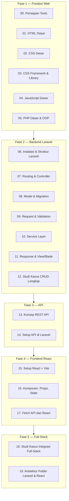

# Journey Belajar Pemrograman Web — Full-Stack Laravel + React

Ini adalah materi belajar terstruktur untuk mengantarkan seseorang dari **nol** (tidak tahu HTML sama sekali) sampai bisa membangun aplikasi **full-stack**: backend API dengan **Laravel** dan frontend modern dengan **React (Vite)**. Seluruh studi kasus dan contoh kode di journey ini memakai **satu skema database nyata dan konsisten**: `db_pendidikan`, berisi 3 tabel master — `mst_mahasiswa`, `mst_dosen`, `mst_matakuliah` (rincian lengkap di [modul 08](08-model-migration-database/README.md#0-skema-database-acuan-db_pendidikan)) — supaya setiap contoh terasa seperti aplikasi sungguhan, bukan `Foo`/`Bar` generik.

> 📌 Materi ini **bukan** dokumentasi teknis aplikasi (untuk itu lihat [`../README.md`](../README.md)). Ini adalah **bahan belajar** — cocok dipakai untuk onboarding developer baru, bahan mengajar, atau belajar mandiri.

## Untuk Siapa Materi Ini?

- Pemula yang baru mulai belajar pemrograman web dari nol.
- Developer yang sudah bisa HTML/CSS/JS tapi belum pernah pakai Laravel atau React.
- Tim yang ingin onboarding anggota baru ke stack yang dipakai proyek ini (Laravel + Blade di backend saat ini, dengan React sebagai opsi frontend modern yang sedang/akan dipelajari tim).

## Cara Memakai Materi Ini

1. **Ikuti urutan nomor** (00 → 19). Materi disusun bertahap — modul belakang mengasumsikan kamu sudah paham modul sebelumnya.
2. Setiap folder punya **satu `README.md`** berisi: tujuan belajar, konsep, contoh kode yang bisa langsung dicoba, mini studi kasus/latihan, dan link ke modul berikutnya.
3. Ada **2 studi kasus besar**, keduanya membangun fitur **"Manajemen Data Mahasiswa"** (tabel `mst_mahasiswa`) dengan pendekatan berbeda:
   - [`12-studi-kasus-crud-mvc-service`](12-studi-kasus-crud-mvc-service/README.md) — CRUD Laravel murni (server-rendered, pakai Blade) dengan struktur lengkap (migration → model → controller → request → service → response → routes).
   - [`18-studi-kasus-fullstack-integrasi`](18-studi-kasus-fullstack-integrasi/README.md) — backend Laravel sebagai **REST API** + frontend **React (Vite)** yang fetch data dari API tersebut. Ini adalah pola arsitektur yang dipakai aplikasi modern kebanyakan saat ini (decoupled frontend/backend).
4. Ada **1 halaman referensi arsitektur** — [`19-arsitektur-folder-laravel-react`](19-arsitektur-folder-laravel-react/README.md) — jadikan ini "kamus" tiap kali lupa folder tertentu buat apa.
5. Praktik langsung. Jangan hanya baca — ketik ulang tiap contoh kode di komputer sendiri.

## Peta Belajar (Roadmap)

## Daftar Isi

| # | Modul | Ringkasan |
|---|---|---|
| 00 | [Persiapan Tools](00-persiapan-tools/README.md) | Software yang wajib terinstal: text editor, PHP, Composer, Node.js, Git, database, XAMPP/Laragon |
| 01 | [HTML Dasar](01-html-dasar/README.md) | Struktur dokumen, tag, semantic HTML, form |
| 02 | [CSS Dasar](02-css-dasar/README.md) | Selector, box model, flexbox, grid, responsive design |
| 03 | [CSS Framework & Library](03-css-framework-library/README.md) | Bedanya library vs framework, Bootstrap vs Tailwind CSS |
| 04 | [JavaScript Dasar](04-javascript-dasar/README.md) | Variabel, fungsi, array/object, DOM, async/fetch — fondasi wajib sebelum React |
| 05 | [PHP Dasar & OOP](05-php-dasar-oop/README.md) | Sintaks PHP, class, object, interface — fondasi wajib sebelum Laravel |
| 06 | [Instalasi & Struktur Laravel](06-instalasi-struktur-laravel/README.md) | Install Laravel, kenalan `artisan`, `.env`, struktur folder awal |
| 07 | [Routing & Controller](07-routing-controller/README.md) | `routes/web.php`, resource controller, route model binding |
| 08 | [Model & Migration](08-model-migration-database/README.md) | Eloquent ORM, migration, relasi antar tabel, seeder & factory |
| 09 | [Request & Validation](09-request-validation/README.md) | Form Request class, validasi, custom rule, authorize |
| 10 | [Service Layer](10-service-layer/README.md) | Kenapa perlu Service, memisahkan logic dari Controller |
| 11 | [Response & View/Blade](11-response-view-blade/README.md) | Blade templating, redirect, JSON response, flash message |
| 12 | [**Studi Kasus**: CRUD Lengkap](12-studi-kasus-crud-mvc-service/README.md) | Bangun fitur "Data Mahasiswa" (`mst_mahasiswa`) end-to-end: migration → model → request → service → controller → response → routes |
| 13 | [Konsep REST API](13-konsep-api-rest/README.md) | HTTP method, status code, JSON, REST constraint, tools (Postman) |
| 14 | [Setup API di Laravel](14-setup-api-laravel/README.md) | `routes/api.php`, API Resource, Sanctum, versioning, CORS |
| 15 | [Setup React + Vite](15-react-vite-setup/README.md) | Instalasi, struktur folder proyek Vite, JSX dasar |
| 16 | [Komponen, Props, State](16-react-komponen-props-state/README.md) | Component, props, `useState`, `useEffect`, event handling |
| 17 | [Fetch API dari React](17-react-fetch-api-axios/README.md) | `fetch` vs `axios`, loading/error state, custom hook |
| 18 | [**Studi Kasus**: Integrasi Full-Stack](18-studi-kasus-fullstack-integrasi/README.md) | Laravel API + React SPA — CRUD "Data Mahasiswa" yang sama, kali ini decoupled |
| 19 | [Arsitektur Folder Laravel & React](19-arsitektur-folder-laravel-react/README.md) | Referensi lengkap: setiap folder di Laravel & React, fungsinya apa |

## Prasyarat

- Komputer dengan akses terminal (Windows/Mac/Linux, semua contoh disertai perintah untuk PowerShell & bash).
- Koneksi internet untuk instalasi package (Composer, NPM).
- Tidak perlu pengalaman coding sebelumnya untuk mulai dari modul 00 — tapi kalau sudah bisa HTML/CSS/JS dasar, boleh lompat ke modul 05.

## Filosofi Materi Ini

- **Kode dulu, teori secukupnya.** Setiap konsep disertai contoh yang bisa langsung dijalankan.
- **Struktur lengkap sejak awal.** Studi kasus Laravel sengaja tidak menaruh semua logic di Controller — supaya kebiasaan yang terbentuk sejak awal adalah kebiasaan yang scalable (migration, model, request, service, response, routes terpisah rapi).
- **Satu skema data konsisten dari awal sampai akhir.** Contoh domain (Mahasiswa, Dosen, Mata Kuliah) memakai persis struktur tabel `mst_mahasiswa`, `mst_dosen`, `mst_matakuliah` di database `db_pendidikan` — bukan `Foo`/`Bar`/`Post` generik yang berubah-ubah tiap modul.
